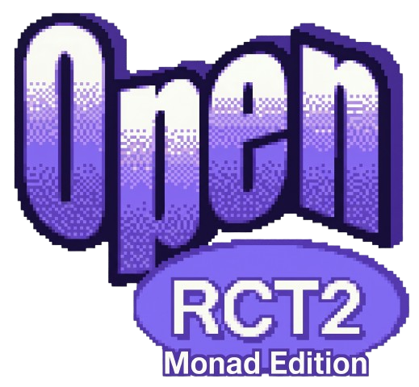

  

<h1 align="center">OpenRCT2 — Claude Plays RCT2 × Monad</h1>

<h3 align="center">A creative fork of <a href="https://github.com/OpenRCT2/OpenRCT2">OpenRCT2</a> that adds an in-game terminal for a coding agent (Claude Code) and an on-chain mode that mirrors every guest spend to the Monad testnet.</h3>

---

## What this fork adds

- **In-game agent terminal.** A new toolbar window hosts a full vterm that
  launches Claude Code (or a bootstrap REPL) talking to the game through
  the `rctctl` CLI. See [`CODING_AGENT.md`](CODING_AGENT.md) and
  [`RCTCTL.md`](RCTCTL.md).
- **Chain mode (`--chain`).** Each guest is a real EVM account on Monad
  testnet; spends are EIP-712 signed, batched by a Node sidecar, and submitted
  via a relayer pool. See [`CHAIN.md`](CHAIN.md) and [`ONCHAIN_PLAN.md`](ONCHAIN_PLAN.md).
- **Bundled fonts + toolbar art.** `data/fonts/NotoSansSymbols*` (SIL Open
  Font License, see `data/fonts/NotoSansSymbols-LICENSE.txt`) and Claude toolbar
  icons.

---

## Getting started

The full step-by-step is in [`QUICKSTART.md`](QUICKSTART.md). Short version:

1. **Deploy contracts** (or reuse the committed `monad-testnet.json`) →
   [`contracts/README.md`](contracts/README.md)
2. **Build** the game + sidecar + CLI:
   `cmake -S . -B build -G Ninja && cmake --build build --target agent_bundle -j8`
   → [`SETUP.md`](SETUP.md)
3. **Launch the game** (auto-spawns the sidecar):
   `KEYSTORE_PASSPHRASE=… scripts/launch-game.sh`
   → [`CHAIN.md`](CHAIN.md), [`scripts/launch-game.sh`](scripts/launch-game.sh)
4. **Start the indexer** in another terminal: `scripts/start-indexer.sh` →
   [`indexer/README.md`](indexer/README.md)
5. **Watch the chain feed**: `scripts/chain-feed.sh` (or `.mjs` for push-based)

Verify with `rctctl chain status` and `scripts/check-sidecar.sh`.

---

## Live deployment (Monad testnet)

The committed `contracts/deployments/monad-testnet.json` points at the
addresses below. All links open
[Monadscan](https://testnet.monadscan.com/) so you can watch transactions,
holders, and events live while a park is running. Chain id `10143`, deploy
height `29424477`.

| Scope | Contract | Address | Role |
|---|---|---|---|
| Global | `ParkToken` | [`0x9b37…4218`](https://testnet.monadscan.com/address/0x9b37c4a296a28F2374838fbcD45fdF8aA4A94218) | ERC-20 PARK — every guest holds a real balance |
| Global | `Faucet` | [`0x8bF1…F8bE3`](https://testnet.monadscan.com/address/0x8bF1C52eb596f58589b5dF2aC2E34199E2FF8bE3) | Mints PARK to new guests on entry |
| Global | `Disperse` | [`0x87B3…0089`](https://testnet.monadscan.com/address/0x87B378d9199E1CE589196CEE6A53e2acA50c0089) | Batch-fund relayers / guests with MON |
| Park | `ParkTreasury` | [`0x3764…C0fB`](https://testnet.monadscan.com/address/0x37641EBcfC29A6070da81389dD2E3461A4B1C0fB) | Collects settled spends; borrower for the demo loan |
| Park | `LendingPool` | [`0x8A06…F4E9`](https://testnet.monadscan.com/address/0x8A06cEc79E7C6BfB399Be57c9e653A35f56fF4E9) | Loan against future revenue; emits `LoanChanged` / `Bankruptcy` |
| Park | `GuestRegistry` | [`0xa2dd…9902`](https://testnet.monadscan.com/address/0xa2dd713F0dC6138640c7Fb8fac660812787a9902) | `Entry` / `Exit` events for every guest |
| Park | `VenueRegistry` | [`0x6384…9270`](https://testnet.monadscan.com/address/0x6384430d201E8fF6bF6bee8Acb99882b0A119270) | Rides, shops, stalls, ATMs as on-chain venue ids |
| Park | `SettlementBatcher` | [`0x67d3…7B52`](https://testnet.monadscan.com/address/0x67d35905B93d4F4a82a5CDcca8c0400198F57B52) | High-throughput `settle(N)` — the headline tx |
| — | Deployer | [`0x74f2…0386`](https://testnet.monadscan.com/address/0x74f29100178a388f8cf3872D4d73F65F66fD0386) | EOA that deployed and owns admin roles |

The `SettlementBatcher` page is the most interesting one — each tx packs
dozens to hundreds of EIP-712 `SpendAuth` signatures and that's where the
`auth/s` headline number actually shows up on-chain.

---

## Original RCT2 game files

OpenRCT2 needs the original RollerCoaster Tycoon 2 assets — buy on
[Steam](https://store.steampowered.com/app/285330/RollerCoaster_Tycoon_2_Triple_Thrill_Pack/)
or [GOG.com](https://www.gog.com/game/rollercoaster_tycoon_2) and launch once
so the files install to `~/Library/Application Support/OpenRCT2/` (macOS).
You can also [point at RCT1 assets](https://github.com/OpenRCT2/OpenRCT2/wiki/Loading-RCT1-scenarios-and-data)
to play the original scenarios.

This fork is hacked on from scratch — there is no plan to merge upstream and
no compatibility commitment. For the unmodified game, use upstream OpenRCT2.

---

## Contributing

This repo is primarily an experiment, but PRs are welcome.

- Code-of-conduct: [`CODE_OF_CONDUCT.md`](CODE_OF_CONDUCT.md)
- Style + workflow: [`CONTRIBUTING.md`](CONTRIBUTING.md)
- Privacy policy: [`PRIVACY.md`](PRIVACY.md)
- Agent integration architecture: [`CODING_AGENT.md`](CODING_AGENT.md)
- Background on the upstream project: [openrct2.io](https://openrct2.io),
  [GitHub](https://github.com/OpenRCT2/OpenRCT2)

---

## Licence

**OpenRCT2** is licensed under the GNU General Public License version 3 or
(at your option) any later version. See [`licence.txt`](licence.txt) for the
full text.

Bundled Noto Sans Symbols fonts are licensed under the SIL Open Font
License — see [`data/fonts/NotoSansSymbols-LICENSE.txt`](data/fonts/NotoSansSymbols-LICENSE.txt).

---

## Similar projects

| [OpenLoco](https://github.com/OpenLoco/OpenLoco) | [OpenTTD](https://github.com/OpenTTD/OpenTTD) | [openage](https://github.com/SFTtech/openage) | [OpenRA](https://github.com/OpenRA/OpenRA) |
|:------------------------------------------------:|:----------------------------------------------------------------------------------------------------------:|:-------------------------------------------------------------------------------------------------------:|:-------------------------------------------------------------------------------------------------------------:|
|  |  |  |  |
| Chris Sawyer's Locomotion | Transport Tycoon Deluxe | Age of Empires 2 | Red Alert |

## Sponsors (upstream OpenRCT2)

| [DigitalOcean](https://www.digitalocean.com/)                                                                                                                     | [JetBrains](https://www.jetbrains.com/)                                                                                                        | [Backtrace](https://backtrace.io/)                                                                                                        | [SignPath](https://signpath.org/)                                                                                  |
|-------------------------------------------------------------------------------------------------------------------------------------------------------------------|------------------------------------------------------------------------------------------------------------------------------------------------|-------------------------------------------------------------------------------------------------------------------------------------------|--------------------------------------------------------------------------------------------------------------------|
|  |  |  |  |
| Hosting of various services                                                                                                                                       | CLion and other products                                                                                                                       | Minidump uploads and inspection                                                                                                           | Free code signing provided by [SignPath.io](https://about.signpath.io/), certificate by [SignPath Foundation](https://signpath.org/).                                                                                                       |
